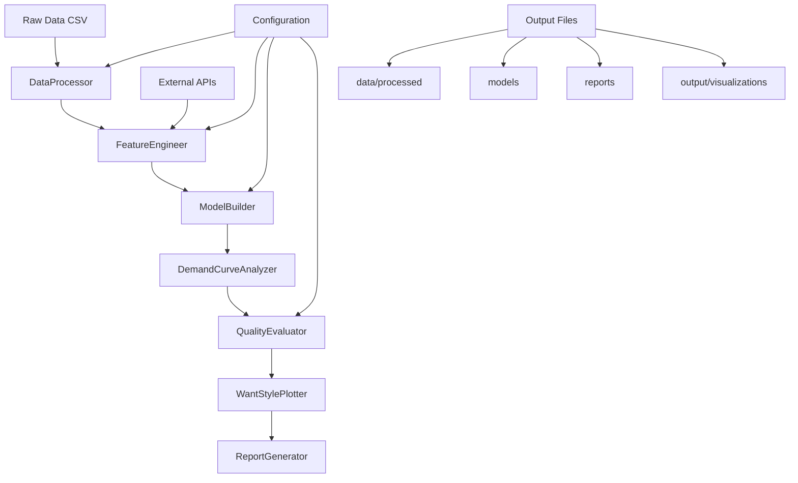

# Design Document

## Overview

生鮮食品需要予測・分析システムは、既存の notebook 分析を基盤として、実用的で保守可能な Python パッケージとして設計されます。システムは段階的な特徴量エンジニアリング、堅牢なモデル構築、直感的な可視化、包括的なレポート生成を提供します。

## Architecture

### System Architecture



### Module Structure

```
src/
├── demand_forecasting/
│   ├── __init__.py
│   ├── core/
│   │   ├── __init__.py
│   │   ├── data_processor.py      # データ前処理
│   │   ├── feature_engineer.py    # 特徴量エンジニアリング
│   │   ├── model_builder.py       # モデル構築・評価
│   │   └── demand_analyzer.py     # 需要曲線分析
│   ├── visualization/
│   │   ├── __init__.py
│   │   ├── want_plotter.py        # want_style_plotter統合
│   │   └── quality_dashboard.py   # 品質ダッシュボード
│   ├── utils/
│   │   ├── __init__.py
│   │   ├── config.py              # 設定管理
│   │   ├── logger.py              # ログ管理
│   │   └── external_apis.py       # 外部API（気象データ）
│   └── reports/
│       ├── __init__.py
│       └── report_generator.py    # レポート生成
├── config/
│   └── config.yaml                # システム設定
└── main.py                        # メインエントリーポイント
```

## Components and Interfaces

### 1. DataProcessor

**責任**: 生鮮食品データの読み込み・前処理・クリーニング

```python
class DataProcessor:
    def __init__(self, config: Dict[str, Any])
    def load_raw_data(self, file_path: str) -> pd.DataFrame
    def detect_encoding(self, file_path: str) -> str
    def clean_data(self, df: pd.DataFrame) -> pd.DataFrame
    def handle_missing_values(self, df: pd.DataFrame) -> pd.DataFrame
    def remove_outliers(self, df: pd.DataFrame, method: str = 'iqr') -> pd.DataFrame
    def create_basic_features(self, df: pd.DataFrame) -> pd.DataFrame
```

**主要機能**:

- Shift-JIS 文字エンコーディングの自動検出・変換
- 欠損値・重複・異常値の検出・処理
- 基本特徴量（売上単価、月、曜日、週末フラグ）の自動生成
- IQR 法による外れ値除去

### 2. FeatureEngineer

**責任**: 段階的な特徴量エンジニアリング

```python
class FeatureEngineer:
    def __init__(self, config: Dict[str, Any])
    def create_baseline_features(self, df: pd.DataFrame) -> pd.DataFrame
    def add_time_features(self, df: pd.DataFrame) -> pd.DataFrame
    def integrate_weather_features(self, df: pd.DataFrame) -> pd.DataFrame
    def select_features(self, df: pd.DataFrame, target: str) -> List[str]
    def get_feature_importance(self, df: pd.DataFrame, features: List[str], target: str) -> Dict[str, float]
```

**特徴量カテゴリ**:

- **ベースライン**: 基本的な時系列・価格特徴量
- **時間特徴量**: 時刻・混雑度・時間帯ダミー変数
- **気象特徴量**: 外気温・気温区分・移動平均・フラグ変数

### 3. ModelBuilder

**責任**: 機械学習モデルの構築・評価・解釈

```python
class ModelBuilder:
    def __init__(self, config: Dict[str, Any])
    def build_model(self, X: pd.DataFrame, y: pd.Series) -> RandomForestRegressor
    def train_with_cv(self, X: pd.DataFrame, y: pd.Series) -> Dict[str, Any]
    def evaluate_model(self, model: Any, X_test: pd.DataFrame, y_test: pd.Series) -> Dict[str, float]
    def get_feature_importance(self, model: Any, feature_names: List[str]) -> Dict[str, float]
    def calculate_shap_values(self, model: Any, X: pd.DataFrame) -> np.ndarray
    def detect_overfitting(self, train_score: float, test_score: float) -> float
```

**主要機能**:

- RandomForestRegressor による堅牢なモデル構築
- 交差検証による性能評価（R²、RMSE、MAE）
- SHAP 値による解釈可能性の提供
- 過学習検出・防止

### 4. DemandCurveAnalyzer

**責任**: 需要曲線分析・価格最適化

```python
class DemandCurveAnalyzer:
    def __init__(self, config: Dict[str, Any])
    def analyze_demand_curve(self, df: pd.DataFrame, product: str) -> Dict[str, Any]
    def calculate_optimal_price(self, price_demand_data: pd.DataFrame) -> float
    def calculate_price_elasticity(self, price_demand_data: pd.DataFrame) -> float
    def apply_smoothing(self, data: np.ndarray, method: str = 'savgol') -> np.ndarray
    def fit_demand_curve(self, price: np.ndarray, quantity: np.ndarray) -> Callable
```

**分析手法**:

- 非線形回帰による需要曲線フィッティング
- Savitzky-Golay 平滑化による外れ値処理
- 収益最大化ポイントの数値計算
- 価格弾力性の定量化

### 5. QualityEvaluator

**責任**: モデル品質評価・分類

```python
class QualityEvaluator:
    def __init__(self, config: Dict[str, Any])
    def evaluate_quality_level(self, r2_score: float) -> str
    def assess_implementation_readiness(self, model_metrics: Dict[str, float]) -> str
    def calculate_category_success_rate(self, results: List[Dict]) -> Dict[str, float]
    def generate_quality_dashboard_data(self, results: List[Dict]) -> Dict[str, Any]
```

**品質レベル**:

- **Premium** (R² ≥ 0.7): 即座実行可能
- **Standard** (0.5 ≤ R² < 0.7): 慎重実行
- **Basic** (0.3 ≤ R² < 0.5): 要考慮
- **Rejected** (R² < 0.3): 改善必要

## Data Models

### 1. ProductData

```python
@dataclass
class ProductData:
    product_code: str
    product_name: str
    category_hierarchy: Dict[str, str]  # 大分類、中分類、小分類、細分類
    daily_sales: pd.DataFrame
    features: pd.DataFrame
    metadata: Dict[str, Any]
```

### 2. ModelResult

```python
@dataclass
class ModelResult:
    product_name: str
    model: Any
    features: List[str]
    performance_metrics: Dict[str, float]  # r2_score, rmse, mae
    feature_importance: Dict[str, float]
    quality_level: str
    implementation_readiness: str
    overfitting_score: float
    shap_values: Optional[np.ndarray] = None
```

### 3. DemandCurveResult

```python
@dataclass
class DemandCurveResult:
    product_name: str
    optimal_price: float
    current_price: float
    price_elasticity: float
    demand_curve_function: Callable
    r2_score: float
    price_range: Tuple[float, float]
    quantity_range: Tuple[float, float]
```

### 4. AnalysisReport

```python
@dataclass
class AnalysisReport:
    analysis_date: datetime
    total_products: int
    successful_products: int
    success_rate: float
    model_results: List[ModelResult]
    demand_curves: List[DemandCurveResult]
    quality_distribution: Dict[str, int]
    category_success_rates: Dict[str, float]
    feature_importance_summary: Dict[str, float]
    improvement_effects: List[Tuple[str, float]]
```

## Error Handling

### Exception Hierarchy

```python
class DemandForecastingError(Exception):
    """Base exception for demand forecasting system"""
    pass

class DataProcessingError(DemandForecastingError):
    """Data processing related errors"""
    pass

class FeatureEngineeringError(DemandForecastingError):
    """Feature engineering related errors"""
    pass

class ModelBuildingError(DemandForecastingError):
    """Model building related errors"""
    pass

class VisualizationError(DemandForecastingError):
    """Visualization related errors"""
    pass
```

### Error Handling Strategy

1. **Graceful Degradation**: 一部の商品で分析が失敗しても、他の商品の分析を継続
2. **Detailed Logging**: 各段階でのエラー詳細をログに記録
3. **Fallback Mechanisms**: 外部 API 失敗時の代替データ使用
4. **User-Friendly Messages**: エラー内容を分かりやすく報告

## Testing Strategy

### 1. Unit Tests

- 各コンポーネントの個別機能テスト
- データ処理ロジックの正確性検証
- エラーハンドリングの動作確認

### 2. Integration Tests

- コンポーネント間の連携テスト
- エンドツーエンドの分析フロー検証
- 外部 API 連携テスト

### 3. Data Quality Tests

- 入力データの形式・内容検証
- 特徴量生成の正確性確認
- モデル出力の妥当性チェック

### 4. Performance Tests

- 大量データでの処理時間測定
- メモリ使用量の監視
- 並列処理の効率性検証

## Configuration Management

### config.yaml Structure

```yaml
data:
  raw_data_path: "data/raw/納品用_20240101_20241231_生鮮全品data.csv"
  encoding: "shift_jis"
  processed_data_path: "data/processed"

feature_engineering:
  baseline_features:
    - "売上単価"
    - "月"
    - "曜日"
    - "週末フラグ"

  time_features:
    enable_time_assignment: true
    enable_congestion: true
    time_distribution_type: "bimodal"

  weather_features:
    enable_weather_api: true
    api_endpoint: "https://api.open-meteo.com/v1/forecast"
    location: "Tokyo"

model:
  algorithm: "RandomForest"
  n_estimators: 100
  max_depth: 10
  random_state: 42
  cv_folds: 5

quality:
  thresholds:
    premium: 0.7
    standard: 0.5
    basic: 0.3

  overfitting_threshold: 0.1

visualization:
  output_dir: "output/visualizations"
  dpi: 300
  style: "want_style"

logging:
  level: "INFO"
  format: "%(asctime)s - %(name)s - %(levelname)s - %(message)s"
  file: "logs/demand_forecasting.log"
```

## Performance Considerations

### 1. Data Processing Optimization

- **Chunked Processing**: 大量データを分割して処理
- **Vectorized Operations**: pandas の最適化された操作を活用
- **Memory Management**: 不要なデータの適切な削除

### 2. Model Training Optimization

- **Feature Selection**: 相関分析による冗長特徴量の除去
- **Parallel Processing**: 商品別分析の並列実行
- **Model Caching**: 訓練済みモデルの保存・再利用

### 3. Visualization Optimization

- **Lazy Loading**: 必要時のみ可視化を生成
- **Format Optimization**: 適切な画像形式・解像度の選択
- **Batch Generation**: 複数の可視化を一括生成

## Security Considerations

### 1. Data Protection

- **Sensitive Data Handling**: 商品コード・価格情報の適切な管理
- **Access Control**: データファイルへのアクセス制限
- **Data Anonymization**: 必要に応じた商品名の匿名化

### 2. External API Security

- **API Key Management**: 環境変数による認証情報管理
- **Rate Limiting**: API 呼び出し頻度の制限
- **Error Handling**: API 障害時の適切な処理

### 3. Output Security

- **File Permissions**: 出力ファイルの適切な権限設定
- **Path Validation**: ファイルパスの検証
- **Content Sanitization**: レポート内容の適切なエスケープ
